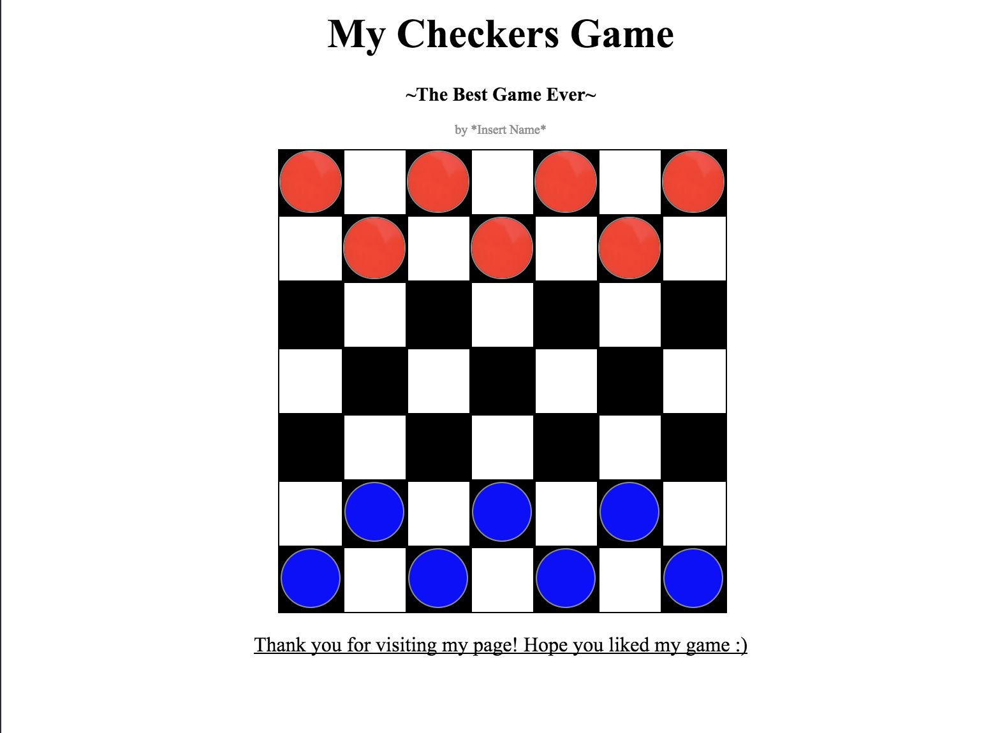

# CSS Selector Challenges

## The Goal
In this lab, we're going to be taking a deep dive into CSS selectors. When styling your html it's important to be able to easily identify and select the exact elements that you want to style.

## The Lab
If you open up your index.html file you'll see a full page of html ready to be styled. This file has been linked to the style.css file that you also have access to. You may notice that when you preview the html file, nothing on the page seems to actually be styled. This is because despite the fact that the styling rules have been written for you (in style.css), the selectors used to identify which elements the rules will apply to have not been.

Your job is to work through the specifications for each of the selectors (detailed below), to achieve the final result:

The details for each selector are written below, replace each "selector_i" with the correct selector to see styling begin to occur on the page. This [link](https://www.w3schools.com/cssref/css_selectors.asp) has some really great information to get you going. Make sure to use control f to search through the page for specific key words and feel free to search for other resources if you aren't finding what you need!

When you first preview the html, you'll see a title, some other text and a lot of red. Don't worry, by the end of this lab your page will be exactly like the game we're trying to build!

* **selector_1**: Should select all h1 elements on the page. If this selector is done correctly, you'll see that your title "My Checkers Game" is centered on the page.

* **selector_2**: Should select the element with an id of "board". Once this selector is done, you'll see that the red chunk of images shift towards the right.

* **selector_3**: Should select all elements with a class of "subtitle". Now you'll see that the "~The Best Game Ever~" text shifts to the centered of the page and the font becomes smaller.

* **selector_4**: Should select every paragraph directly after an h2. You'll see that the text "by Insert Name" becomes centered, grey, and smaller.

* **selector_5**: Should select every paragraph element that is directly preceded by a div. (Do this in a different way from the selector you used for selector_6). This will center and underline the text underneath the board(the area currently filled with red images).

* **selector_6**: Should select all image elements that have a parent that is a div. When this selector is correct, you'll see that the board area becomes a very small jagged grey line, this will be fixed soon.

* **selector_7**: Should select all elements with a class of "cell" that have a div as a parent(not just all elements with a class of cell, since in this case a cell is just a square area and therefore the board is also just a larger cell). The correct selector will result in the outlines of all of the cells of the board correctly displaying. You will also be able to see all of the red board pieces. The board should still be centered.

* **selector_8**: Should select every div inside of another div inside of another div. This will result in the blue pieces appearing.

* **selector_9**: Should select every odd numbered element that has the class "cell" as well as a parent that has an id of "board" (with cell 1 being the first element with a class of cell that has a parent element with an id of board and so on).

Hint for Selector 9

*First, figure out how to select every odd number element with a particular class, then use what you used in the above two selectors to specify what the parent must be.*

* **selector_10**: Should select all image elements when you hover your mouse over them AND all of the elements selected in selector 8 (div inside of div inside of div) when you hover your mouse over them. This will result in all of the board pieces getting a yellow border when you place your mouse over them.

Hint for Selector 10

*First, figure out how to select every image element when you hover over it. Then use this pattern to select every div inside of a div inside of a div when you hover over it. Finally, figure out how to select two types of things at the same time.*

## Extensions
Now that your board is looking great and you've become a css selector master, here are some extensions to keep improving your page!
1. Add and change style rules so that the background of the board alternates between three different colors. (For example, a white cell, then a black cell, then a purple cell repeated across the entire board).
2. Add html to the index.html file that gives the person looking at your page all of the rules of checkers. This can be done however you want to. Then write your own style rules to make this section of the page look great.
3. Research a selector that we didn't use in this lab, then find a way to use it. Feel free to add html as needed to make the selector applicable.
